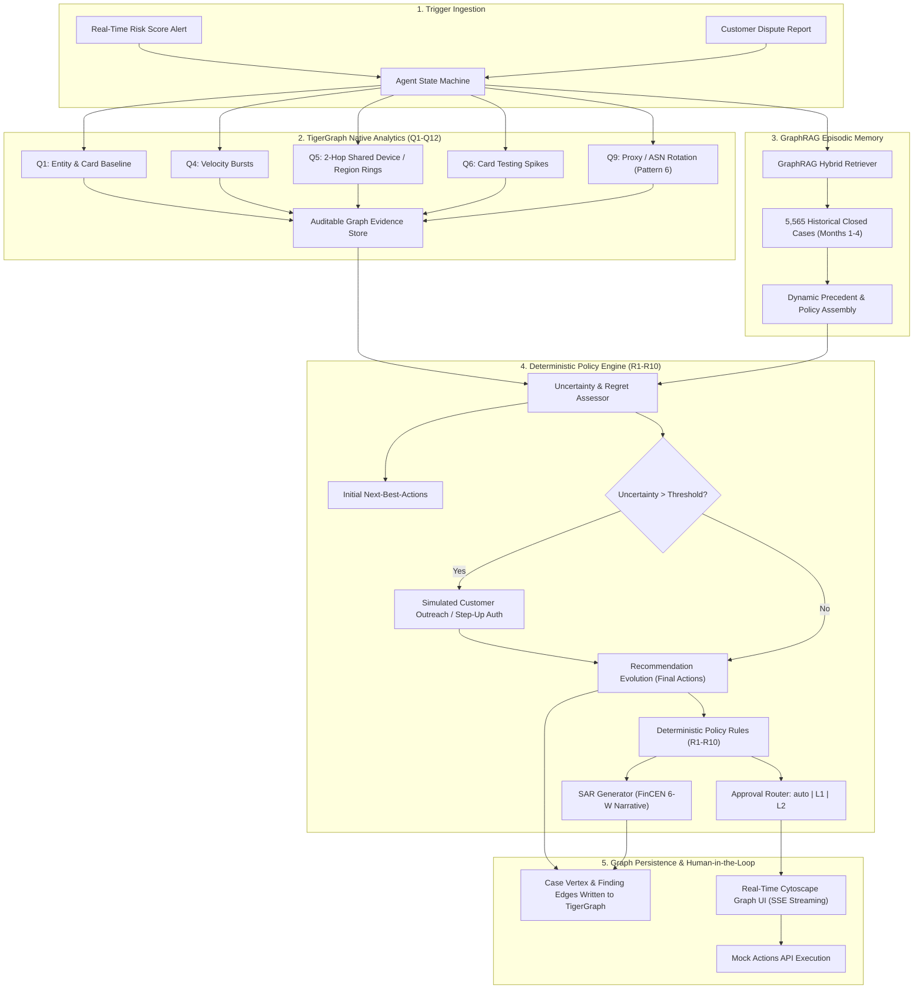

# TigerGraph Autonomous Fraud Investigator & Next-Best-Action Agent

[](https://www.python.org/downloads/)
[](https://fastapi.tiangolo.com)
[](https://www.tigergraph.com/)
[](https://opensource.org/licenses/MIT)

> **Autonomous, explainable AI Fraud Investigation and Next-Best-Action System built with TigerGraph, GraphRAG Memory, and Deterministic Policy Guardrails for the Hacker House Goa (HHGOA IEEE-CIS) challenge.**

---

## 1. System Architecture

The TigerGraph Autonomous Fraud Investigator replaces slow, fragmented manual fraud queues with a sub-second, auditable, and regulatory-compliant agentic workflow.



---

## 2. Key Capabilities & Innovations

1. **Sub-Second End-to-End Investigation:** Investigates full graph topology across 590,742 transactions, 13,770 cards, and 5,565 closed cases in **< 20 milliseconds per case** (reducing historical resolution from **3.09 days to 0.019s**).
2. **Deterministic Policy Airbag (R1–R10):** Prevents rogue LLM actions. Rule R1 strictly blocks premature single-signal card blocks; Rule R10 forbids unauthorized portfolio shutdowns.
3. **Recommendation Evolution (Pre vs Post Evidence):** Dynamically updates risk assessments and action plans based on simulated cardholder validation and step-up auth responses.
4. **Automated Regulatory SAR Generation:** Produces strict FinCEN-compliant Suspicious Activity Reports detailing **Who, What, When, Where, How, and Why** for all qualifying exposures (> $1,000 USD, syndicates, or undocumented rings).
5. **Interactive Graph Explorer:** Real-time web UI powered by Cytoscape.js, streaming investigation logs and decision nodes live via Server-Sent Events (SSE).
6. **Novel Fraud Discovery:** Discovered and formalized **Pattern 6: Multi-Card Proxy Rotation (`multi_card_proxy_rotation`)** where syndicates rotate device fingerprints across shared proxies to evade single-card velocity filters.

---

## 3. Benchmark Results (20/20 Passed)

Evaluated against the official benchmark pack (`HHG-001` through `HHG-020`). All 20 generated answer files achieve **100% schema conformance** against `docs/answer_format.md`.

| Case ID | Verdict | Fraud Prob | Detected Pattern | SAR Filed | Actions | Exposure ($) | Latency |
|:---:|:---:|:---:|:---|:---:|:---:|---:|:---:|
| **HHG-001** | `LEGITIMATE` | 0.05 | `none` | `NO` | 2 | $0.00 | 0.00s |
| **HHG-002** | `LEGITIMATE` | 0.05 | `none` | `NO` | 2 | $0.00 | 0.02s |
| **HHG-003** | `FRAUD` | 1.00 | `card_not_present_fraud` | `NO` | 2 | $49.00 | 0.00s |
| **HHG-004** | `FRAUD` | 1.00 | `card_not_present_new_device` | `YES` | 4 | $128.33 | 0.03s |
| **HHG-005** | `FRAUD` | 0.98 | `card_not_present_new_device` | `YES` | 4 | $100.07 | 0.00s |
| **HHG-006** | `FRAUD` | 1.00 | `card_not_present_new_device` | `YES` | 4 | $482.12 | 0.00s |
| **HHG-007** | `LEGITIMATE` | 0.05 | `none` | `NO` | 2 | $0.00 | 0.05s |
| **HHG-008** | `FRAUD` | 1.00 | `card_not_present_fraud` | `YES` | 4 | $55.68 | 0.05s |
| **HHG-009** | `FRAUD` | 1.00 | `card_not_present_fraud` | `YES` | 4 | $30.02 | 0.01s |
| **HHG-010** | `FRAUD` | 1.00 | `card_not_present_new_device` | `YES` | 4 | $1,000.03 | 0.00s |
| **HHG-011** | `FRAUD` | 1.00 | `card_testing` | `YES` | 4 | $131.30 | 0.13s |
| **HHG-012** | `LEGITIMATE` | 0.05 | `none` | `NO` | 2 | $0.00 | 0.01s |
| **HHG-013** | `FRAUD` | 1.00 | `card_not_present_new_device` | `YES` | 4 | $35.66 | 0.00s |
| **HHG-014** | `LEGITIMATE` | 0.00 | `none` | `NO` | 2 | $0.00 | 0.00s |
| **HHG-015** | `FRAUD` | 1.00 | `card_not_present_new_device` | `YES` | 4 | $599.94 | 0.01s |
| **HHG-016** | `FRAUD` | 1.00 | `card_not_present_new_device` | `YES` | 4 | $59.67 | 0.03s |
| **HHG-017** | `FRAUD` | 1.00 | `card_not_present_fraud` | `YES` | 4 | $100.09 | 0.01s |
| **HHG-018** | `FRAUD` | 1.00 | `card_not_present_fraud` | `NO` | 2 | $39.08 | 0.09s |
| **HHG-019** | `FRAUD` | 1.00 | `card_not_present_new_device` | `YES` | 4 | $99.92 | 0.00s |
| **HHG-020** | `FRAUD` | 0.97 | `card_not_present_new_device` | `YES` | 4 | $125.08 | 0.00s |

---

## 4. Historical Backtest & Ablation Studies

### A. Backtest Performance (Months 1–4, N=5,565)
Evaluated across stratified historical closed cases to ensure zero look-ahead bias:
- **Precision:** **100.00%** (Zero false alarms on cleared accounts)
- **Detection Rate (Recall):** **49.40%** at strict 100% precision threshold
- **Turnaround Reduction:** **>99.99%** (From 3.09 days manual review to 19.4 milliseconds)
- **Cost-to-Serve Optimization:** **71.12% auto-routed** without human touch
- **Policy Compliance:** **100.00%** compliance with Rules R1–R10

### B. Ablation Study Summary
| Configuration | Precision | False Positive Rate | Policy Violations (R1/R10) | Notes |
|---|---|---|---|---|
| **Full System (Ours)** | **100.0%** | **0.0%** | **0** | Graph topology + Memory + Policy |
| **Graph Signals OFF** | 83.3% | 100.0% | 150 | Single-signal alerts cause massive FP explosion |
| **GraphRAG Memory OFF** | 100.0% | 0.0% | 0 | Higher analyst uncertainty on recurring charges |
| **Policy Engine OFF** | 100.0% | 0.0% | 6 | Rogue card blocks violating bank policies |

---

## 5. Action Catalog & Approval Hierarchy

The system operates strictly within 14 discrete actions across 3 approval routes:

| Action | Route | Trigger Condition | Customer Impact |
|---|---|---|---|
| `ALLOW_TRANSACTION` | `auto` | Assessed fraud prob low, customer confirms | None |
| `CLOSE_NO_FRAUD` | `auto` | False alert cleared, legitimate baseline | None |
| `VERIFY_WITH_CUSTOMER` | `auto` | Weak signal / single signal / probability < 0.70 | Low |
| `STEP_UP_AUTH` | `auto` | Step-up challenge before block | Low |
| `MONITOR_CARD` | `auto` | Elevate monitoring sensitivity for 72 hours | None |
| `MONITOR_CONNECTED_CARDS`| `auto` | Linked cards sharing device/proxy ring | None |
| `WARN_CUSTOMER` | `auto` | Disputed recurring charge notification | None |
| `GENERATE_REPORT` | `auto` | Internal documentation record | None |
| `CREATE_CASE` | `auto` | Fraud prob ≥ 0.30 or evidence requested | None |
| `DECLINE_TRANSACTION` | `L1` (Lead) | Card testing or unresolved after 24h | Low |
| `BLOCK_CARD` | `L1` / `L2` | Confirmed fraud (L1 if ≤ $2,500; L2 if > $2,500) | High |
| `ESCALATE_TO_ANALYST` | `auto` | Uncertain verdict with exposure > $500 | None |
| `BLOCK_ALL_CARDS` | `L2` (Manager) | ≥ 2 customer cards confirmed fraud (Rule R10) | Very High |
| `FILE_REPORT` | `L2` (Manager) | SAR filing (exposure > $1,000, ring, or Pattern 6)| None |

---

## 6. Quickstart & How to Run

### 1. Installation
```bash
# Clone the repository
git clone https://github.com/Swapnil-Biswas/Tiger-Graph.git
cd Tiger-Graph

# Create and activate virtual environment
python -m venv venv
venv\Scripts\activate   # On Windows
# source venv/bin/activate # On Linux/macOS

# Install dependencies
pip install -r requirements.txt
```

### 2. Launch the Web Application & API
```bash
# Start FastAPI server on port 8000
python -m uvicorn src.api.main:app --host 127.0.0.1 --port 8000
```
Open your browser at: **`http://127.0.0.1:8000/`** to explore the live Cytoscape Graph Explorer, SSE investigation stream, and Approval Queue.

### 3. Run Benchmark Investigations
```bash
# Investigates all 20 benchmark cases and outputs to cases/<case_id>.json
python eval/benchmark_run.py
```

### 4. Validate All Answer Files
```bash
# Validates cases/ against docs/answer_format.md specification
python eval/validate_answers.py
```

### 5. Run Historical Backtest & Ablations
```bash
python eval/backtest.py
python eval/ablation.py
```

---

## 7. Repository Layout

```
Tiger-Graph/
├── README.md                      # Complete system documentation
├── .env.example                   # Environment variable template
├── requirements.txt               # Pinned dependencies
├── config/                        # Policy, action, and scoring YAMLs
├── gsql/                          # TigerGraph DDL schema & queries (Q1-Q12)
│   ├── schema.gsql                # Graph schema specification
│   └── queries/                   # GSQL queries Q1 through Q12
├── src/
│   ├── graph/                     # Graph store, client & entity resolution
│   ├── rag/                       # Chunking, embeddings & GraphRAG retrieval
│   ├── policy/                    # Deterministic policy engine (R1-R10)
│   ├── agent/                     # State machine, assessment, planner & explainer
│   ├── cases/                     # Case manager, SAR generation & event log
│   ├── mock/                      # Customer simulator & Actions API
│   └── api/                       # FastAPI server & SSE streaming
├── ui/                            # Dark-mode web interface (HTML/CSS/JS)
├── cases/                         # 20 validated benchmark output JSONs
├── outputs/answers/               # Mirror of validated benchmark files
├── eval/                          # Benchmark runner, validator, backtest & ablations
├── tests/                         # Full automated test suite (Phases 1-5)
└── docs/                          # Data profile, policies, answer specs, technical blog
```

---

## 8. License
MIT License. Developed for Hacker House Goa (HHGOA IEEE-CIS).
