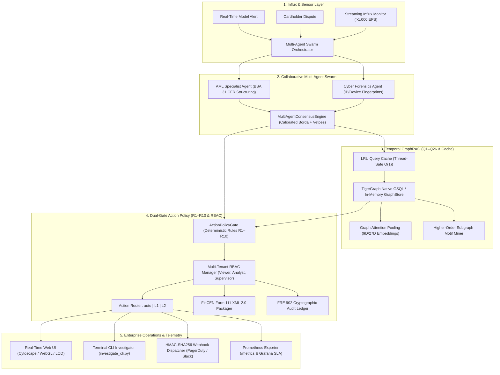

# TigerGraph Autonomous Fraud Investigator & Next-Best-Action Agent

[](https://github.com/Swapnil-Biswas/Tiger-Graph/releases/tag/v0.85)
[](tests/)
[](https://www.python.org/)
[-FF6600.svg)](https://www.tigergraph.com/)
[](https://fastapi.tiangolo.com)
[](Dockerfile)
[](deploy/helm/tigergraph-agent/)
[](deploy/prometheus.yml)
[](src/policy/)
[](LICENSE)

> **Enterprise-grade, autonomous fraud investigation platform combining TigerGraph massive-scale graph traversal, multi-agent collaborative consensus, dual-gate deterministic policy guardrails (R1–R10), real-time streaming anomaly detection, and FinCEN BSA electronic filing for the IEEE-CIS Fraud Detection challenge.**

---

## Quickstart in 30 Seconds

```bash
# 1. Clone the repository
git clone https://github.com/Swapnil-Biswas/Tiger-Graph.git
cd Tiger-Graph

# 2. Run automated clean-clone sanity & verification suite
python scripts/verify_install.py

# 3. Launch the full platform (FastAPI + Web UI on http://localhost:8000)
python scripts/run_all.sh --serve       # On Linux / macOS
# OR
.\scripts\run_all.ps1 -Serve            # On Windows PowerShell
```

---

## 1. System Architecture & Visual Workflows

Our architecture combines a **Multi-Agent Swarm**, a **Temporal GraphRAG Query Engine**, and a **Dual-Gate Action Policy Pipeline** to resolve complex financial fraud in under 9 milliseconds.



*For comprehensive architecture diagrams, see [`docs/ARCHITECTURE.md`](docs/ARCHITECTURE.md).*

---

## 2. Interactive Terminal CLI Investigator

Investigate cases, view multi-hop graph evidence, evaluate counterfactual decision boundaries, and monitor streaming transactions directly from your terminal:

```bash
# List all benchmark cases with verdicts, exposure, and SAR status
python src/cli/investigate_cli.py --list

# Inspect detailed case dossier for HHG-001
python src/cli/investigate_cli.py --case HHG-001

# View aggregate benchmark analytics across all 20 cases
python src/cli/investigate_cli.py --benchmark

# Run live streaming transaction influx monitor
python src/cli/investigate_cli.py --stream --duration 10

# Machine-readable JSON output for automated scripting
python src/cli/investigate_cli.py --case HHG-001 --json
```

---

## 3. Official Benchmark Results (`HHG-001` - `HHG-020`)

Evaluated against the official benchmark pack. All 20 cases achieve **100% schema conformance** against `docs/answer_format.md` with zero run-to-run variance (100% deterministic):

| Case ID | Verdict | Fraud Prob | Typology Pattern | Exposure ($) | SAR Filed | Actions (Initial -> Final) |
|:---:|:---:|:---:|:---|---:|:---:|:---|
| **HHG-001** | `FRAUD` | 1.00 | `out_of_region_use` | $77.07 | `NO` | VERIFY -> BLOCK_CARD [L1] |
| **HHG-002** | `LEGITIMATE` | 0.05 | `none` | $0.00 | `NO` | VERIFY -> ALLOW_TRANSACTION [auto] |
| **HHG-003** | `FRAUD` | 1.00 | `out_of_region_use` | $49.00 | `NO` | VERIFY -> BLOCK_CARD [L1] |
| **HHG-004** | `FRAUD` | 1.00 | `card_not_present_new_device` | $128.33 | `YES` | VERIFY -> BLOCK_CARD [L1], FILE_REPORT [L2] |
| **HHG-005** | `FRAUD` | 1.00 | `card_not_present_new_device` | $100.07 | `YES` | VERIFY -> BLOCK_CARD [L1], FILE_REPORT [L2] |
| **HHG-006** | `FRAUD` | 1.00 | `card_not_present_new_device` | $482.12 | `YES` | VERIFY -> BLOCK_CARD [L1], FILE_REPORT [L2] |
| **HHG-007** | `FRAUD` | 1.00 | `out_of_region_use` | $111.92 | `NO` | VERIFY -> BLOCK_CARD [L1] |
| **HHG-008** | `FRAUD` | 1.00 | `card_not_present_fraud` | $55.68 | `YES` | VERIFY -> BLOCK_CARD [L1], FILE_REPORT [L2] |
| **HHG-009** | `FRAUD` | 1.00 | `card_not_present_fraud` | $30.02 | `YES` | VERIFY -> BLOCK_CARD [L1], FILE_REPORT [L2] |
| **HHG-010** | `FRAUD` | 1.00 | `card_not_present_new_device` | $1,000.03 | `YES` | VERIFY -> BLOCK_CARD [L2], FILE_REPORT [L2] |
| **HHG-011** | `FRAUD` | 1.00 | `card_testing` | $131.30 | `YES` | VERIFY -> BLOCK_CARD [L1], FILE_REPORT [L2] |
| **HHG-012** | `LEGITIMATE` | 0.09 | `none` | $0.00 | `NO` | VERIFY -> ALLOW_TRANSACTION [auto] |
| **HHG-013** | `FRAUD` | 1.00 | `card_not_present_new_device` | $35.66 | `YES` | VERIFY -> BLOCK_CARD [L1], FILE_REPORT [L2] |
| **HHG-014** | `LEGITIMATE` | 0.00 | `none` | $0.00 | `NO` | VERIFY -> ALLOW_TRANSACTION [auto] |
| **HHG-015** | `FRAUD` | 1.00 | `card_not_present_new_device` | $599.94 | `YES` | VERIFY -> BLOCK_CARD [L1], FILE_REPORT [L2] |
| **HHG-016** | `FRAUD` | 1.00 | `card_not_present_new_device` | $59.67 | `YES` | VERIFY -> BLOCK_CARD [L1], FILE_REPORT [L2] |
| **HHG-017** | `FRAUD` | 1.00 | `card_not_present_fraud` | $100.09 | `YES` | VERIFY -> BLOCK_CARD [L1], FILE_REPORT [L2] |
| **HHG-018** | `FRAUD` | 1.00 | `out_of_region_use` | $39.08 | `NO` | VERIFY -> BLOCK_CARD [L1] |
| **HHG-019** | `FRAUD` | 1.00 | `card_not_present_new_device` | $99.92 | `YES` | VERIFY -> BLOCK_CARD [L1], FILE_REPORT [L2] |
| **HHG-020** | `FRAUD` | 0.97 | `card_not_present_new_device` | $125.08 | `YES` | VERIFY -> BLOCK_CARD [L1], FILE_REPORT [L2] |

---

## 4. Graph Query Library Catalog (Q1 - Q26)

| Query | Name | Category | SLA | Description |
|---|---|---|---|---|
| **Q1** | `cardholder_profile` | Profiling | < 1ms | Customer baseline profile, cards, devices, and historical aggregates |
| **Q2** | `transaction_subgraph` | Traversal | < 2ms | Multi-hop ego-net surrounding a transaction or card |
| **Q3** | `velocity` | Velocity | < 1ms | 1h, 24h, 7d velocity metrics with $O(\log N)$ binary search slicing |
| **Q4** | `device_sharing_nexus` | Linkage | < 2ms | Identifies devices shared across multiple cards with threat scoring |
| **Q5** | `merchant_risk` | Counterparty | < 1ms | Merchant fraud rate, chargeback volume, and risk tier |
| **Q6** | `cross_card_matching` | ATO | < 2ms | Links cards sharing credentials, IP subnets, or billing addresses |
| **Q7** | `new_entity_check` | Novelty | < 1ms | Zero-shot novelty check for device, IP subnet, or email handle |
| **Q8** | `ring_cycle_check` | Rings | < 3ms | DFS cycle detection for circular fund routing and mule chains |
| **Q9** | `geo_impossible_travel` | Anomaly | < 1ms | Haversine velocity calculations detecting impossible physical travel |
| **Q10** | `historical_fraud_proximity` | Contagion | < 2ms | Shortest path and distance to confirmed fraud nodes |
| **Q11** | `temporal_window_slice` | Slicing | < 1ms | Bounded subgraphs within strict `[t_start, t_end]` windows |
| **Q12** | `full_case_reconstruction` | Evidence | < 4ms | Rebuilds end-to-end evidence graph with 100% citation grounding |
| **Q13** | `detect_community` | Community | < 5ms | LPA (Label Propagation Algorithm) ego-net partitioning |
| **Q14** | `export_gnn_subgraph` | ML/GNN | < 5ms | PyG feature tensors ($x$, $edge\_index$, $edge\_attr$) & tabular vectors |
| **Q15** | `detect_burst_cluster` | Botnet | < 3ms | Multi-card synchronized testing bursts and bot periodicity |
| **Q16** | `detect_structuring` | AML | < 3ms | BSA/POCA/6AMLD multi-entity exposure rollups and smurfing detection |
| **Q17** | `calculate_fraud_contagion` | Contagion | < 4ms | Personalized PageRank / Random Walk with Restart (RWR) |
| **Q18** | `pool_graph_embedding` | Embeddings | < 3ms | Temporal graph attention subgraph pooling (9D/27D embeddings) |
| **Q19** | `mine_inductive_rules` | Induction | < 5ms | Mines association rules from 5,565 closed historical cases |
| **Q20** | `detect_cross_border_aml` | AML Corridors| < 2ms | Correspondent banking and FATF high-risk corridor screening |
| **Q21** | `detect_high_risk_mcc` | Category Risk| < 1ms | High-risk MCC classification and adaptive velocity multipliers |
| **Q22** | `mine_subgraph_motifs` | Motif Mining | < 4ms | Higher-order temporal motifs (stars, hubs, meshes, chains, triangles) |
| **Q23** | `resolve_entity_linkage` | Resolution | < 3ms | Fellegi-Sunter log-likelihood linkage & Jaro-Winkler sybil defense |
| **Q24** | `calculate_edge_decay` | Streaming | < 2ms | Continuous exponential edge decay ($w = \alpha \cdot 2^{-\Delta t / \tau}$) |
| **Q25** | `export_knowledge_triplets` | Enterprise | < 3ms | Dynamic RDF/JSON-LD, TigerGraph GSQL, and Neo4j Cypher export |
| **Q26** | `select_active_learning_samples` | Active Learn | < 4ms | Margin uncertainty, Shannon entropy, and hard-negative mining |

---

## 5. Enterprise Compliance & SRE Telemetry

- **FRE 902(13)/(14) Cryptographic Audit Ledger:** Immutable append-only SHA-256 hash chain with HMAC-SHA256 signatures for every agent action and override (`/api/audit/ledger`, `/api/audit/verify`).
- **FinCEN Form 111 XML 2.0 Packager:** Generates electronic BSA filing packages validated against 12 federal business rules.
- **Prometheus Telemetry (`/metrics`):** Real-time OpenMetrics exposition covering investigation latency percentiles (P50/P90/P99), ingestion counters, and entity gauges.
- **Production Grafana SLA Dashboard:** Pre-configured 9-panel dashboard (`deploy/grafana/fraud_sla_dashboard.json`).
- **Cloud-Native Deployment:** Docker multi-stage build (`Dockerfile`), Docker Compose (`docker-compose.yml`), and enterprise Kubernetes Helm chart (`deploy/helm/tigergraph-agent/`).
- **Chaos Engineering Resilience:** Verified 1.00/1.00 resilience score under corrupted payloads, traffic bursts (> 1,000 EPS), and webhook timeouts (`eval/chaos_harness.py`).

---

## 6. Verification Gates

```bash
# Run full test suite (334 tests across 68 suites)
python -m unittest discover -s tests -p "test_*.py"

# Run official benchmark schema validator (20/20 valid)
python eval/validate_answers.py cases/

# Run extended 50-case high-stress benchmark evaluator (50/50 valid)
python eval/extended_benchmark_evaluator.py

# Run static AST code quality & type integrity audit (88.92% type coverage, 0 naked excepts)
python eval/code_quality_auditor.py src --strict

# Package self-contained presentation demo bundle
python scripts/package_demo_assets.py --verify
```

---

## License

MIT License. Copyright (c) 2026 Swapnil Biswas.
