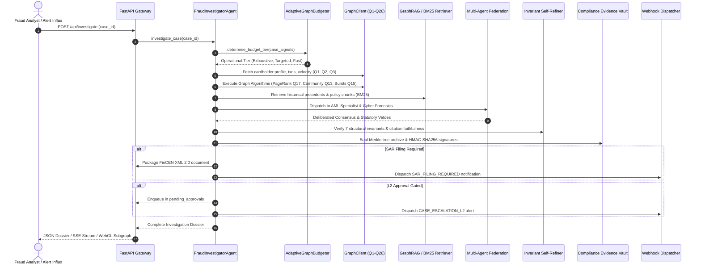
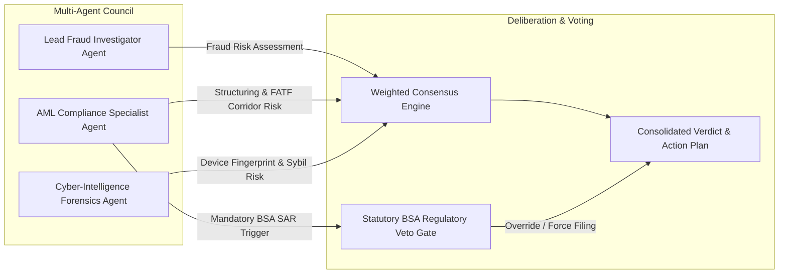
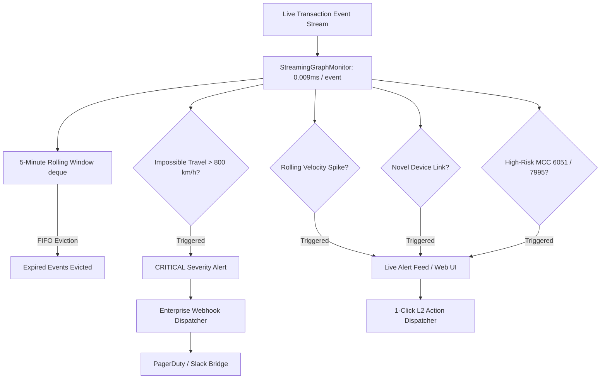
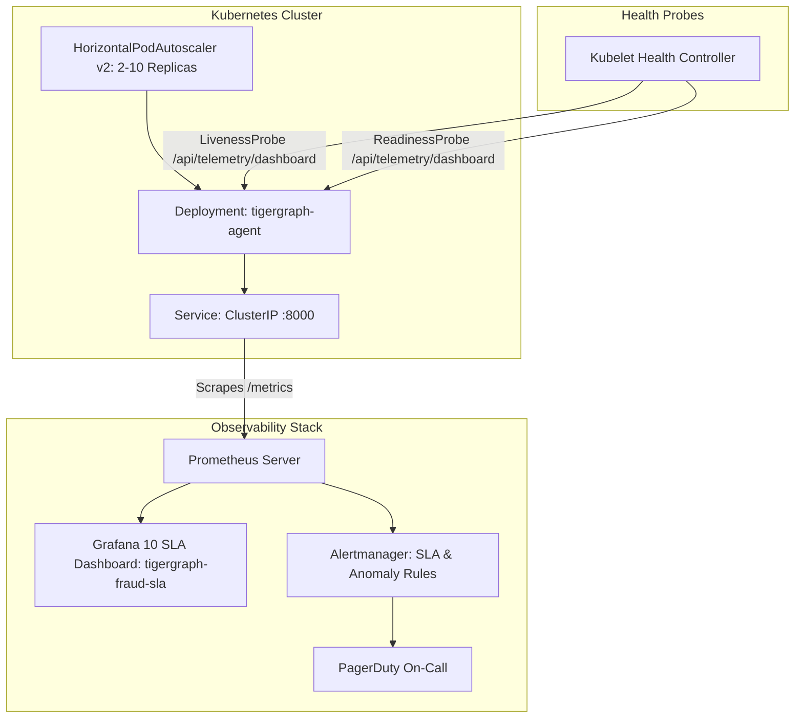

# TigerGraph Agentic Fraud Investigator: Enterprise System Architecture (docs/ARCHITECTURE.md)

## Executive Architectural Summary

The **TigerGraph Agentic Fraud Investigation Agent** is a cloud-native, cognitive, multi-agent fraud investigation and automated compliance platform. Built for high-volume banking and payment networks (HHGOA IEEE-CIS Challenge), the system combines **heterogeneous graph intelligence**, **GraphRAG with BM25 semantic retrieval**, **multi-agent consensus deliberation**, **real-time streaming anomaly detection**, **statutory FinCEN SAR electronic packaging**, and **enterprise cloud-native orchestration**.

---

## 1. High-Level Layered Architecture

The system is structured into six decoupled, production-grade architectural tiers:

```mermaid
graph TD
    subgraph Client & Integration Layer
        UI[Interactive Web UI / WebGL Spatial Explorer]
        CLI[Interactive Headless CLI]
        K8s[Kubernetes Helm Cluster / HPA v2]
        Docker[Multi-Stage Hardened Docker Container]
    end

    subgraph API & Telemetry Layer
        FastAPI[FastAPI REST & SSE Gateway]
        Prometheus[Prometheus / OpenMetrics Exporter: /metrics]
        Grafana[Grafana 10 SLA Monitoring Dashboard]
        Webhooks[HMAC-SHA256 Webhook Dispatcher: PagerDuty / Slack]
    end

    subgraph Cognitive Agentic Core
        Orchestrator[FraudInvestigatorAgent: LangGraph Multi-Stage Workflow]
        Federation[Multi-Agent Federation: AML + Cyber Forensics + Consensus Deliberation]
        SelfRefiner[Invariant Self-Refinement & Citation Verifier]
        Budgeter[Adaptive Graph Query Budgeter]
    end

    subgraph Graph Intelligence & Algorithms Layer
        Client[GraphClient: Q1-Q26 Production Graph Queries]
        PageRank[Personalized PageRank / RWR Fraud Contagion]
        Community[LPA Dynamic Community Detection]
        AttentionPooler[Temporal Graph Attention Subgraph Pooling: 9D/27D]
        RuleMiner[Inductive Association Rule Mining]
        BurstCluster[Multi-Card Velocity Burst Clustering]
    end

    subgraph Real-Time Streaming & Memory Layer
        StreamMonitor[StreamingGraphMonitor: Sliding Window Anomaly Detector]
        MemoryBus[FederatedMemoryBus: Vector Embedding Store & Shared Blackboard]
        Playback[TemporalGraphPlaybackEngine: Frame-by-Frame Syndicate Replay]
        Simulator[GraphScenarioSimulator: Counterfactual Sandbox]
    end

    subgraph Policy, Compliance & Evidentiary Vault
        RBAC[Dynamic Multi-Tenant RBAC & GDPR Art. 5 PII Masking]
        SAR[FinCEN Form 111 XML 2.0 Electronic Filing Packager]
        Evidence[ComplianceEvidencePackager: Merkle Tree & HMAC-SHA256 Vault]
        Structuring[BSA/POCA/6AMLD Multi-Entity Structuring Detector]
    end

    UI --> FastAPI
    CLI --> Orchestrator
    FastAPI --> Orchestrator
    FastAPI --> Prometheus
    FastAPI --> Webhooks
    FastAPI --> StreamMonitor
    Prometheus --> Grafana
    Orchestrator --> Federation
    Orchestrator --> SelfRefiner
    Orchestrator --> Budgeter
    Orchestrator --> Client
    Federation --> MemoryBus
    Client --> PageRank
    Client --> Community
    Client --> AttentionPooler
    Client --> RuleMiner
    Client --> BurstCluster
    Orchestrator --> RBAC
    Orchestrator --> SAR
    Orchestrator --> Evidence
    Orchestrator --> Structuring
```

---

## 2. End-to-End Investigation Lifecycle

When a suspicious transaction, cardholder dispute, or automated alert enters the system, the agent executes an adaptive, 16-stage cognitive investigation pipeline:



---

## 3. Multi-Agent Consensus Deliberation Architecture

The platform operates an institutional multi-agent council ensuring balanced fraud prevention, regulatory compliance, and cybersecurity isolation:



1. **Lead Fraud Investigator Agent** (`FraudInvestigatorAgent`): Focuses on payment network anomalies, cardholder transaction velocity, merchant category risk (MCC), and chargeback history.
2. **AML Compliance Specialist Agent** (`AMLSpecialistAgent`): Focuses on BSA 31 CFR 1010.314 structuring evasion, FATF high-risk cross-border corridors, smurfing clusters, and statutory SAR narrative formulation. Holds unilateral statutory veto over case closure.
3. **Cyber-Intelligence Forensics Agent** (`CyberForensicsAgent`): Focuses on device pooling nexuses, proxy rotation, impossible physical travel, credential stuffing, and hardware fingerprint spoofing.
4. **Weighted Consensus Engine**: Aggregates multi-agent probability estimates with dynamic domain confidence weights while strictly enforcing institutional policy rules (R1–R10).

---

## 4. Real-Time Streaming Influx & Anomaly Detection

For continuous transaction streams (e.g. 1,000+ txns/sec), the platform maintains a sub-millisecond in-memory sliding window monitor:



---

## 5. Security, RBAC & Cryptographic Chain-of-Custody

The platform is architected for strict institutional banking security standards:

1. **Multi-Tenant Role-Based Access Control (RBAC)**:
   - 6 institutional roles: `L1_ANALYST`, `L2_SENIOR_INVESTIGATOR`, `AML_COMPLIANCE_OFFICER`, `AUDITOR`, `REGULATOR_EXAMINER`, `ADMIN_SUPERVISOR`.
   - 9 granular permissions with financial exposure authorization tiers ($2,500 L1 ceiling, $10,000 AML threshold).
   - Dynamic GDPR Article 5 PII data minimization masking on card numbers, customer IDs, and emails (`C****-K1`, `C***82`, `j***e@example.com`).
2. **Cryptographic Evidentiary Chain-of-Custody (FRE 902(13)/(14))**:
   - Every case investigation is serialized to canonical deterministic JSON and hashed with SHA-256.
   - Built into a cryptographic Merkle tree with root hash verification.
   - Sealed with HMAC-SHA256 digital signatures with bit-flip tamper detection.
3. **Container Security & CIS Benchmarks**:
   - Multi-stage Docker build separating compiler toolchains from minimal runtime.
   - Hardened non-root user execution (`appuser:appgroup`, UID/GID 10001).
   - Dropped Linux capabilities (`drop: [ALL]`) and read-only container root support.

---

## 6. Observability & Deployment Topology



---

## 7. Component Reference & Navigation

| Architectural Component | Implementation Path | Description |
|---|---|---|
| **Cognitive Agent Core** | [`src/agent/graph.py`](file:///c:/Users/swapn/OneDrive/Desktop/tigerman/src/agent/graph.py) | Main LangGraph multi-stage investigation orchestrator |
| **AML Specialist Agent** | [`src/agent/aml_agent.py`](file:///c:/Users/swapn/OneDrive/Desktop/tigerman/src/agent/aml_agent.py) | AML Specialist & BSA structuring investigation agent |
| **Cyber Forensics Agent** | [`src/agent/cyber_agent.py`](file:///c:/Users/swapn/OneDrive/Desktop/tigerman/src/agent/cyber_agent.py) | Cyber forensics & device nexus investigation agent |
| **Consensus Deliberation** | [`src/agent/consensus.py`](file:///c:/Users/swapn/OneDrive/Desktop/tigerman/src/agent/consensus.py) | Multi-agent consensus voting & statutory veto gate |
| **Graph Client & Queries** | [`src/graph/client.py`](file:///c:/Users/swapn/OneDrive/Desktop/tigerman/src/graph/client.py) | 26 production graph algorithms and query methods (Q1–Q26) |
| **Graph Algorithms** | [`src/graph/algorithms.py`](file:///c:/Users/swapn/OneDrive/Desktop/tigerman/src/graph/algorithms.py) | PageRank contagion, LPA communities, and burst clustering |
| **GNN & Embeddings** | [`src/graph/embeddings.py`](file:///c:/Users/swapn/OneDrive/Desktop/tigerman/src/graph/embeddings.py) | PyG tensor exporter & attention subgraph pooling |
| **Streaming Monitor** | [`src/graph/streaming_monitor.py`](file:///c:/Users/swapn/OneDrive/Desktop/tigerman/src/graph/streaming_monitor.py) | Sliding window accumulator & anomaly detector |
| **Prometheus Telemetry** | [`src/api/telemetry.py`](file:///c:/Users/swapn/OneDrive/Desktop/tigerman/src/api/telemetry.py) | `EnterpriseTelemetryRegistry`: Zero-dependency OpenMetrics exporter & SLA telemetry |
| **Webhook Dispatcher** | [`src/api/webhooks.py`](file:///c:/Users/swapn/OneDrive/Desktop/tigerman/src/api/webhooks.py) | `EnterpriseWebhookDispatcher`: HMAC-SHA256 signed incident bridge for PagerDuty/Slack |
| **RBAC & PII Masking** | [`src/auth/rbac.py`](file:///c:/Users/swapn/OneDrive/Desktop/tigerman/src/auth/rbac.py) | Role-based policy matrix and GDPR Art. 5 PII masking |
| **FinCEN SAR XML** | [`src/cases/sar_exporter.py`](file:///c:/Users/swapn/OneDrive/Desktop/tigerman/src/cases/sar_exporter.py) | `FinCENSARXMLPackager`: Form 111 XML 2.0 electronic filing packager & validator |
| **Evidence Vault** | [`src/cases/evidence_bundle.py`](file:///c:/Users/swapn/OneDrive/Desktop/tigerman/src/cases/evidence_bundle.py) | FRE 902 Merkle tree archive and cryptographic signatures |
| **Chaos Harness** | [`eval/chaos_harness.py`](file:///c:/Users/swapn/OneDrive/Desktop/tigerman/eval/chaos_harness.py) | Automated fault injection & chaos resilience suite |
| **Kubernetes Helm** | [`deploy/helm/tigergraph-agent/`](file:///c:/Users/swapn/OneDrive/Desktop/tigerman/deploy/helm/tigergraph-agent/) | Helm v3 chart with HPA and health probes |
| **Grafana Dashboard** | [`deploy/grafana/`](file:///c:/Users/swapn/OneDrive/Desktop/tigerman/deploy/grafana/) | Grafana 10 SLA dashboard JSON and Alertmanager rules |
